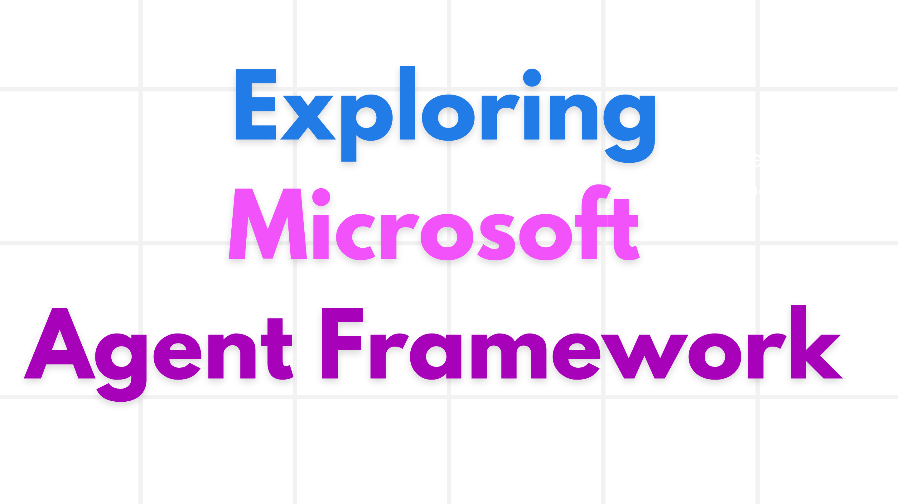
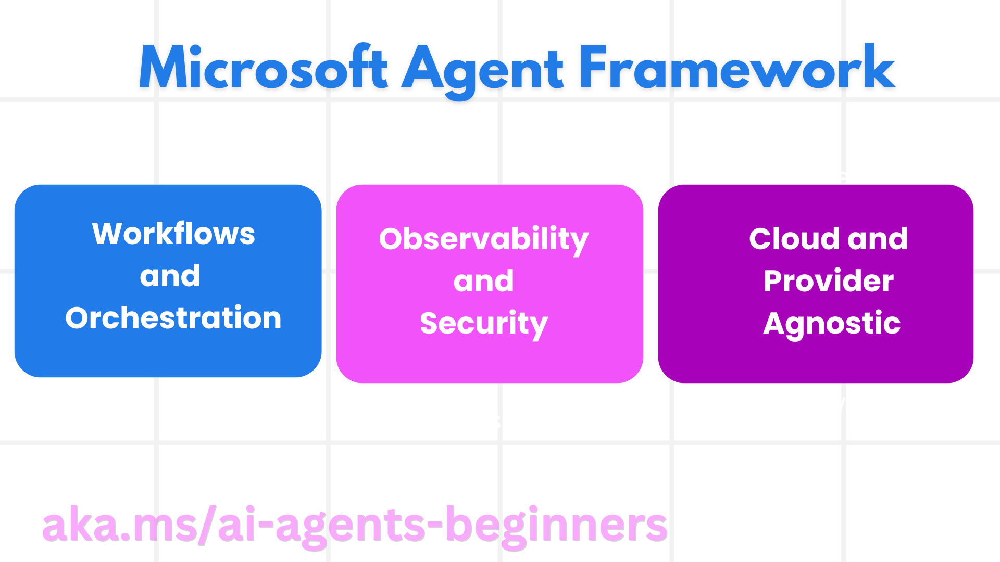
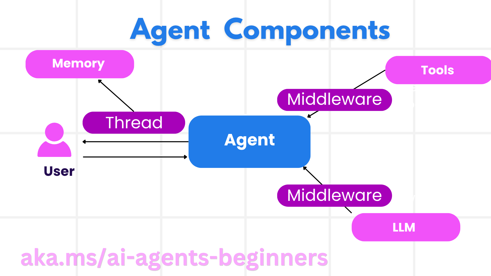

# Exploring Microsoft Agent Framework



### Introduction

This lesson will cover:

- Understanding Microsoft Agent Framework: Key Features and Value  
- Exploring the Key Concepts of Microsoft Agent Framework
- Comparing MAF to Semantic Kernel and AutoGen: Migration Guide

## Learning Goals

After completing this lesson, you will know how to:

- Build Production Ready AI Agents using Microsoft Agent Framework
- Apply the core features of Microsoft Agent Framework to your Agentic Use Cases
- Migrate and integrate existing Agentic frameworks and tools  

## Understanding Microsoft Agent Framework



[Microsoft Agent Framework (MAF)](https://aka.ms/ai-agents-beginners/agent-framewrok) builds on top of the experience and learnings from Semantic Kernel and AutoGen. It offers the flexibility to address the wide variety of agentic use cases seen in both production and research environments including:

- **Sequential Agent orchestration** in scenarios where step-by-step workflows are needed.
- **Concurrent orchestration** in scenarios where agents need to complete tasks at the same time.
- **Group chat orchestration** in scenarios where agents can collaborate together on one task.
- **Handoff Orchestration** in scenarios where agents hand off the task to one another as the subtasks are completed.
- **Magnetic Orchestration** in scenarios where a manager agent creates and modifies a task list and handles the coordination of subagents to complete the task.

To deliver AI Agents in Production, MAF also has included features for:

- **Observability** through the use of OpenTelemetry where every action of the AI Agent including tool invocation, orchestration steps, reasoning flows and performance monitoring through Azure AI Foundry dashboards.
- **Security** by hosting agents natively on Azure AI Foundry which includes security controls such as role-based access, private data handling and built-in content safety.
- **Durability** as Agent threads and workflows can pause, resume and recover from errors which enables longer running process.
- **Control** as human in the loop workflows are supported where tasks are marked as requiring human approval.

Microsoft Agent Framework is also focused on being interoperable by:

- **Being Cloud-agnostic** - Agents can run in containers, on-prem and across multiple different clouds.
- **Being Provider-agnostic** - Agents can be created through your preferred SDK including Azure OpenAI and OpenAI
- **Integrating Open Standards** - Agents can utilize protocols such as Agent-to-Agent(A2A) and Model Context Protocol (MCP) to discover and use other agents and tools.
- **Plugins and Connectors** - Connections can be made to data and memory services such as Microsoft Fabric, SharePoint, Pinecone and Qdrant.

Let's look at how these features are applied to some of the core concepts of Microsoft Agent Framework.

## Key Concepts of Microsoft Agent Framework

### Agents



**Creating Agents**

Agent creation is done by defining the inference service (LLM Provider), a
set of instructions for the AI Agent to follow, and an assigned `name`:

```python
agent = AzureOpenAIChatClient(credential=AzureCliCredential()).create_agent( instructions="You are good at recommending trips to customers based on their preferences.", name="TripRecommender" )
```

The above is using `Azure OpenAI` but agents can be created using a variety of services including `Azure AI Foundry Agent Service`:

```python
AzureAIAgentClient(async_credential=credential).create_agent( name="HelperAgent", instructions="You are a helpful assistant." ) as agent
```

OpenAI `Responses`, `ChatCompletion` APIs

```python
agent = OpenAIResponsesClient().create_agent( name="WeatherBot", instructions="You are a helpful weather assistant.", )
```

```python
agent = OpenAIChatClient().create_agent( name="HelpfulAssistant", instructions="You are a helpful assistant.", )
```

or remote agents using the A2A protocol:

```python
agent = A2AAgent( name=agent_card.name, description=agent_card.description, agent_card=agent_card, url="https://your-a2a-agent-host" )
```

**Running Agents**

Agents are run using the `.run` or `.run_stream` methods for either non-streaming or streaming responses.

```python
result = await agent.run("What are good places to visit in Amsterdam?")
print(result.text)
```

```python
async for update in agent.run_stream("What are the good places to visit in Amsterdam?"):
    if update.text:
        print(update.text, end="", flush=True)

```

Each agent run can also have options to customize parameters such as `max_tokens` used by the agent, `tools` that agent is able to call, and  even the `model` itself used for the agent.

This is useful in cases where specific models or tools are required for completing a user's task.

**Tools**

Tools can be defined both when defining the agent:

```python
def get_attractions( location: Annotated[str, Field(description="The location to get the top tourist attractions for")], ) -> str: """Get the top tourist attractions for a given location.""" return f"The top attractions for {location} are." 


# When creating a ChatAgent directly 

agent = ChatAgent( chat_client=OpenAIChatClient(), instructions="You are a helpful assistant", tools=[get_attractions]

```

and also when running the agent:

```python

result1 = await agent.run( "What's the best place to visit in Seattle?", tools=[get_attractions] # Tool provided for this run only )
```

**Agent Threads**

Agent Threads are used to handle multi-turn conversations. Threads can be created by either by:

- Using `get_new_thread()` which enables the thread to be saved over time
- Creating a thread automatically when running an agent and only having the thread last during the current run.

To create a thread, the code looks like this:

```python
# Create a new thread. 
thread = agent.get_new_thread() # Run the agent with the thread. 
response = await agent.run("Hello, I am here to help you book travel. Where would you like to go?", thread=thread)

```

You can then serialize the thread to be stored for later use:

```python
# Create a new thread. 
thread = agent.get_new_thread() 

# Run the agent with the thread. 

response = await agent.run("Hello, how are you?", thread=thread) 

# Serialize the thread for storage. 

serialized_thread = await thread.serialize() 

# Deserialize the thread state after loading from storage. 

resumed_thread = await agent.deserialize_thread(serialized_thread)
```

**Agent Middleware**

Agents interact with tools and LLMs to complete user's tasks. In certain scenarios, we want to execute or track in between these it interactions. Agent middleware enables us to do this through:

*Function Middleware*

This middleware allows us to execute an action between the agent and a function/tool that it will be calling. An example of when this would be used is when you might want to do some logging on the function call.

In the code below `next` defines if the next middleware or the actual function should be called.

```python
async def logging_function_middleware(
    context: FunctionInvocationContext,
    next: Callable[[FunctionInvocationContext], Awaitable[None]],
) -> None:
    """Function middleware that logs function execution."""
    # Pre-processing: Log before function execution
    print(f"[Function] Calling {context.function.name}")

    # Continue to next middleware or function execution
    await next(context)

    # Post-processing: Log after function execution
    print(f"[Function] {context.function.name} completed")
```

*Chat Middleware*

This middleware allows us to execute or log an action between the agent and the requests between the LLM .

This contains important information such as the `messages` that are being sent to the AI service.

```python
async def logging_chat_middleware(
    context: ChatContext,
    next: Callable[[ChatContext], Awaitable[None]],
) -> None:
    """Chat middleware that logs AI interactions."""
    # Pre-processing: Log before AI call
    print(f"[Chat] Sending {len(context.messages)} messages to AI")

    # Continue to next middleware or AI service
    await next(context)

    # Post-processing: Log after AI response
    print("[Chat] AI response received")

```

**Agent Memory**

As covered in the `Agentic Memory` lesson, memory is an important element to enabling the agent to operate over different contexts. MAF has offers several different types of memories:

*In-Memory Storage*

This is the memory stored in threads during the application runtime.

```python
# Create a new thread. 
thread = agent.get_new_thread() # Run the agent with the thread. 
response = await agent.run("Hello, I am here to help you book travel. Where would you like to go?", thread=thread)
```

*Persistent Messages*

This memory is used when storing conversation history across different sessions. It is defined using the `chat_message_store_factory` :

```python
from agent_framework import ChatMessageStore

# Create a custom message store
def create_message_store():
    return ChatMessageStore()

agent = ChatAgent(
    chat_client=OpenAIChatClient(),
    instructions="You are a Travel assistant.",
    chat_message_store_factory=create_message_store
)

```

*Dynamic Memory*

This memory is added to the context before agents are run. These memories can be stored in external services such as mem0:

```python
from agent_framework.mem0 import Mem0Provider

# Using Mem0 for advanced memory capabilities
memory_provider = Mem0Provider(
    api_key="your-mem0-api-key",
    user_id="user_123",
    application_id="my_app"
)

agent = ChatAgent(
    chat_client=OpenAIChatClient(),
    instructions="You are a helpful assistant with memory.",
    context_providers=memory_provider
)

```

**Agent Observability**

Observability is important to building reliable and maintainable agentic systems. MAF integrates with OpenTelemetry to provide tracing and meters for better observability.

```python
from agent_framework.observability import get_tracer, get_meter

tracer = get_tracer()
meter = get_meter()
with tracer.start_as_current_span("my_custom_span"):
    # do something
    pass
counter = meter.create_counter("my_custom_counter")
counter.add(1, {"key": "value"})
```

### Workflows

MAF offers workflows that are pre-defined steps to complete a task and include AI agents as components in those steps.

Workflows are made up of different components that allow better control flow. Workflows also enable **multi-agent orchestration** and **checkpointing** to save workflow states.

The core components of a workflow are:

**Executors**

Executors receive input messages, perform their assigned tasks, and then produce an output message. This moves the workflow forward toward the completing the larger task. Executors can be either AI agent or custom logic.

**Edges**

Edges are used to define the flow of messages in a workflow. These can be:

*Direct Edges* - Simple one-to-one connections between executors:

```python
from agent_framework import WorkflowBuilder

builder = WorkflowBuilder()
builder.add_edge(source_executor, target_executor)
builder.set_start_executor(source_executor)
workflow = builder.build()
```

*Conditional Edges* - Activated after certain condition is met. For example, when hotels rooms are unavailable, an executor can suggest other options.

*Switch-case Edges* - Route messages to different executors based on defined conditions. For example. if travel customer has priority access and their tasks will be handled through another workflow.

*Fan-out Edges* - Send one message to multiple targets.

*Fan-in Edges* - Collect multiple messages from different executors and send to one target.

**Events**

To provide better observability into workflows, MAF offers built-in events for execution including:

- `WorkflowStartedEvent`  - Workflow execution begins
- `WorkflowOutputEvent` - Workflow produces an output
- `WorkflowErrorEvent` - Workflow encounters an error
- `ExecutorInvokeEvent`  - Executor starts processing
- `ExecutorCompleteEvent`  -  Executor finishes processing
- `RequestInfoEvent` - A request is issued

## Migrating From Other Frameworks (Semantic Kernel and AutoGen)

### Differences between MAF and Semantic Kernel

**Simplified Agent Creation**

Semantic Kernel relies on the creation of a Kernel instance for every agent. MAF uses has a simplified approach by using extensions for the main providers.

```python
agent = AzureOpenAIChatClient(credential=AzureCliCredential()).create_agent( instructions="You are good at reccomending trips to customers based on their preferences.", name="TripRecommender" )
```

**Agent Thread Creation**

Semantic Kernel requires threads to be created manually. In MAF, the agent is directly assigned a thread.

```python
thread = agent.get_new_thread() # Run the agent with the thread. 
```

**Tool Registration**

In Semantic Kernel, tools are registered to the Kernel and the Kernel is then passed to the agent. In MAF, tools are registered directly during the agent creation process.

```python
agent = ChatAgent( chat_client=OpenAIChatClient(), instructions="You are a helpful assistant", tools=[get_attractions]
```

### Differences between MAF and  AutoGen

**Teams vs Workflows**

`Teams` are the event structure for event driven activity with agents in AutoGen. MAF uses `Workflows` that route data to executors through a graph based architecture.

**Tool Creation**

AutoGen uses `FunctionTool` to wrap functions for agents to call. MAF uses @ai_function which operates similarly but also infers the schemas automatically for each function.

**Agent Behaviour**

Agents are single-turn agents by default in AutoGen unless `max_tool_iterations` is set to something higher. Within MAF the `ChatAgent` is a multi-turn by default meaning that it will keep calling tools until the user's task is complete.

## Got More Questions About Microsoft Agent Framework?

Join the [Azure AI Foundry Discord](https://aka.ms/ai-agents/discord) to meet with other learners, attend office hours and get your AI Agents questions answered.
