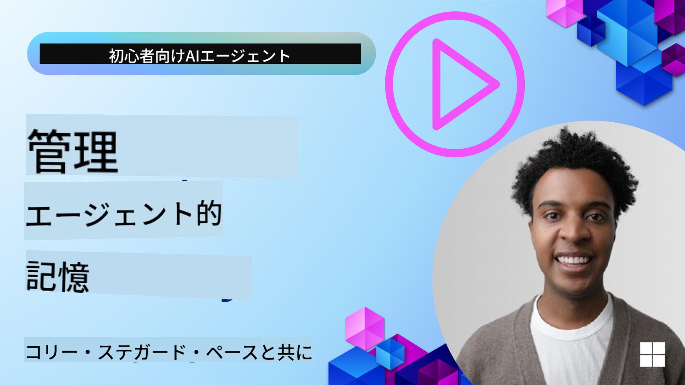

<!--
CO_OP_TRANSLATOR_METADATA:
{
  "original_hash": "d2c9703548140bafa2d6a77406552542",
  "translation_date": "2025-10-03T14:21:46+00:00",
  "source_file": "13-agent-memory/README.md",
  "language_code": "ja"
}
-->
# AIエージェントのメモリ

AIエージェントを作成する際の独自の利点について話すとき、主に議論されるのは、タスクを完了するためにツールを呼び出す能力と、時間とともに改善する能力です。メモリは、自己改善型エージェントを作成し、ユーザーにより良い体験を提供する基盤となります。

このレッスンでは、AIエージェントにおけるメモリとは何か、そしてそれを管理し、アプリケーションの利益のために活用する方法について学びます。

## はじめに

このレッスンでは以下を学びます：

• **AIエージェントのメモリを理解する**: メモリとは何か、そしてエージェントにとってなぜ重要なのか。

• **メモリの実装と保存**: 短期メモリと長期メモリに焦点を当て、AIエージェントにメモリ機能を追加する実践的な方法。

• **AIエージェントを自己改善型にする**: メモリが過去のやり取りから学び、時間とともに改善する方法。

## 学習目標

このレッスンを完了すると、以下ができるようになります：

• **AIエージェントのさまざまなメモリタイプを区別する**: 作業メモリ、短期メモリ、長期メモリ、そしてペルソナメモリやエピソードメモリなどの特殊な形式。

• **Semantic Kernelフレームワークを使用してAIエージェントの短期メモリと長期メモリを実装および管理する**: Mem0やWhiteboardメモリのようなツールを活用し、Azure AI Searchと統合する。

• **自己改善型AIエージェントの原則を理解する**: 強力なメモリ管理システムが継続的な学習と適応にどのように寄与するか。

## AIエージェントのメモリを理解する

基本的に、**AIエージェントのメモリとは、情報を保持し、思い出す仕組みを指します**。この情報には、会話の具体的な詳細、ユーザーの好み、過去の行動、学習したパターンなどが含まれます。

メモリがない場合、AIアプリケーションはしばしばステートレス（状態を持たない）となり、各やり取りがゼロから始まります。この結果、エージェントが以前のコンテキストや好みを「忘れる」ため、繰り返しやイライラするユーザー体験につながります。

### メモリが重要な理由

エージェントの知能は、過去の情報を思い出し活用する能力に深く結びついています。メモリはエージェントを以下のようにします：

• **反省的**: 過去の行動や結果から学ぶ。

• **対話的**: 継続的な会話のコンテキストを維持する。

• **積極的かつ反応的**: 過去のデータに基づいてニーズを予測したり、適切に対応する。

• **自律的**: 保存された知識を活用してより独立して動作する。

メモリを実装する目的は、エージェントをより**信頼性が高く、能力のあるものにする**ことです。

### メモリの種類

#### 作業メモリ

これは、エージェントが単一のタスクや思考プロセス中に使用するメモ帳のようなものです。次のステップを計算するために必要な即時情報を保持します。

AIエージェントの場合、作業メモリは会話の中で最も関連性の高い情報をキャプチャします。たとえチャット履歴が長くても、重要な要素（要件、提案、決定、行動など）を抽出することに焦点を当てます。

**作業メモリの例**

旅行予約エージェントでは、作業メモリがユーザーの現在のリクエストをキャプチャするかもしれません。例えば、「パリへの旅行を予約したい」という具体的な要件が、現在のやり取りを導くためにエージェントの即時コンテキストに保持されます。

#### 短期メモリ

このタイプのメモリは、単一の会話やセッションの間だけ情報を保持します。現在のチャットのコンテキストであり、エージェントが対話の以前のターンを参照できるようにします。

**短期メモリの例**

ユーザーが「パリへのフライトはいくらですか？」と尋ね、その後「そこでは宿泊施設はどうですか？」と続けた場合、短期メモリは「そこ」が同じ会話内で「パリ」を指していることをエージェントに認識させます。

#### 長期メモリ

これは、複数の会話やセッションにわたって情報を保持するものです。ユーザーの好み、過去のやり取り、または一般的な知識を長期間にわたって記憶することで、パーソナライズを可能にします。

**長期メモリの例**

長期メモリは、「ベンはスキーやアウトドア活動を楽しみ、山の景色を見ながらコーヒーを飲むのが好きで、過去の怪我のために高度なスキーコースを避けたい」という情報を保存するかもしれません。この情報は、以前のやり取りから学び、将来の旅行計画セッションで推奨事項に影響を与え、非常にパーソナライズされたものにします。

#### ペルソナメモリ

この特殊なメモリタイプは、エージェントが一貫した「人格」や「ペルソナ」を発展させるのを助けます。エージェントが自分自身や意図された役割についての詳細を記憶することで、やり取りがよりスムーズで焦点を絞ったものになります。

**ペルソナメモリの例**

旅行エージェントが「スキー計画の専門家」として設計されている場合、ペルソナメモリはこの役割を強化し、専門家のトーンや知識に沿った応答をするように影響を与えるかもしれません。

#### ワークフロー/エピソードメモリ

このメモリは、エージェントが複雑なタスクを実行する際のステップの順序（成功や失敗を含む）を記憶します。過去の「エピソード」や経験を覚えて学ぶようなものです。

**エピソードメモリの例**

エージェントが特定のフライトを予約しようとしたが、空きがないため失敗した場合、エピソードメモリはこの失敗を記録し、次回の試みで代替フライトを試したり、問題についてユーザーにより詳しく通知することができます。

#### エンティティメモリ

これは、会話から特定のエンティティ（人、場所、物）やイベントを抽出して記憶することを含みます。これにより、エージェントは話題となった重要な要素を構造化して理解することができます。

**エンティティメモリの例**

過去の旅行についての会話から、エージェントは「パリ」、「エッフェル塔」、「Le Chat Noirレストランでのディナー」といったエンティティを抽出するかもしれません。将来のやり取りで、エージェントは「Le Chat Noir」を思い出し、新しい予約を提案することができます。

#### 構造化RAG（Retrieval Augmented Generation）

RAGは広範な技術ですが、「構造化RAG」は強力なメモリ技術として注目されています。会話、メール、画像などのさまざまなソースから密度の高い構造化情報を抽出し、応答の精度、リコール、速度を向上させます。従来のRAGが意味的類似性にのみ依存するのに対し、構造化RAGは情報の固有の構造を活用します。

**構造化RAGの例**

単なるキーワードの一致ではなく、構造化RAGはメールからフライトの詳細（目的地、日付、時間、航空会社）を解析し、構造化された方法で保存します。これにより、「火曜日にパリへのフライトを予約したのはどれ？」といった正確なクエリが可能になります。

## メモリの実装と保存

AIエージェントのメモリを実装するには、**メモリ管理**の体系的なプロセスが必要です。これには、情報の生成、保存、取得、統合、更新、さらには「忘却」（削除）が含まれます。特に取得は重要な側面です。

### 専門的なメモリツール

エージェントのメモリを保存および管理する方法の1つは、Mem0のような専門的なツールを使用することです。Mem0は永続的なメモリ層として機能し、エージェントが関連するやり取りを思い出し、ユーザーの好みや事実のコンテキストを保存し、成功や失敗から学ぶことを可能にします。このアイデアは、ステートレスエージェントをステートフルに変えることです。

Mem0は**2段階のメモリパイプライン：抽出と更新**を通じて機能します。まず、エージェントのスレッドに追加されたメッセージがMem0サービスに送信され、Large Language Model（LLM）を使用して会話履歴を要約し、新しいメモリを抽出します。その後、LLM駆動の更新フェーズでこれらのメモリを追加、修正、または削除するかどうかを判断し、ベクトル、グラフ、キー値データベースを含むハイブリッドデータストアに保存します。このシステムはさまざまなメモリタイプをサポートし、エンティティ間の関係を管理するためのグラフメモリを組み込むこともできます。

### RAGを使用したメモリの保存

Mem0のような専門的なメモリツールに加えて、**Azure AI Search**のような強力な検索サービスをバックエンドとして使用してメモリを保存および取得することもできます。特に構造化RAGに適しています。

これにより、エージェントの応答を独自のデータで裏付け、より関連性の高い正確な回答を保証します。Azure AI Searchは、ユーザー固有の旅行メモリ、製品カタログ、またはその他のドメイン固有の知識を保存するために使用できます。

Azure AI Searchは、会話履歴、メール、画像などの大規模データセットから密度の高い構造化情報を抽出および取得する際に優れた**構造化RAG**機能をサポートしています。これにより、従来のテキスト分割や埋め込みアプローチと比較して「超人的な精度とリコール」を提供します。

## AIエージェントを自己改善型にする

自己改善型エージェントの一般的なパターンには、**「知識エージェント」**を導入することが含まれます。この別のエージェントは、ユーザーと主要エージェントの間の会話を観察します。その役割は以下の通りです：

1. **価値のある情報を特定する**: 会話のどの部分が一般的な知識や特定のユーザーの好みとして保存する価値があるかを判断する。

2. **抽出と要約**: 会話から本質的な学びや好みを抽出する。

3. **知識ベースに保存する**: 抽出した情報を永続化し、後で取得できるようにする（通常はベクトルデータベースに保存）。

4. **将来のクエリを補強する**: ユーザーが新しいクエリを開始するとき、知識エージェントが関連する保存情報を取得し、ユーザーのプロンプトに追加して主要エージェントに重要なコンテキストを提供する（RAGに類似）。

### メモリの最適化

• **レイテンシ管理**: ユーザーのやり取りを遅くしないように、情報を保存または取得する価値があるかどうかを迅速にチェックするために、安価で高速なモデルを最初に使用し、必要に応じてより複雑な抽出/取得プロセスを呼び出す。

• **知識ベースの維持管理**: 増大する知識ベースに対して、使用頻度の低い情報を「コールドストレージ」に移動してコストを管理する。

## エージェントメモリについてさらに質問がありますか？

[Azure AI Foundry Discord](https://aka.ms/ai-agents/discord)に参加して、他の学習者と交流したり、オフィスアワーに参加したり、AIエージェントに関する質問に答えてもらいましょう。

---

**免責事項**:  
この文書は、AI翻訳サービス[Co-op Translator](https://github.com/Azure/co-op-translator)を使用して翻訳されています。正確性を追求しておりますが、自動翻訳には誤りや不正確な部分が含まれる可能性があることをご承知ください。元の言語で記載された文書が正式な情報源とみなされるべきです。重要な情報については、専門の人間による翻訳を推奨します。この翻訳の使用に起因する誤解や誤解について、当社は責任を負いません。