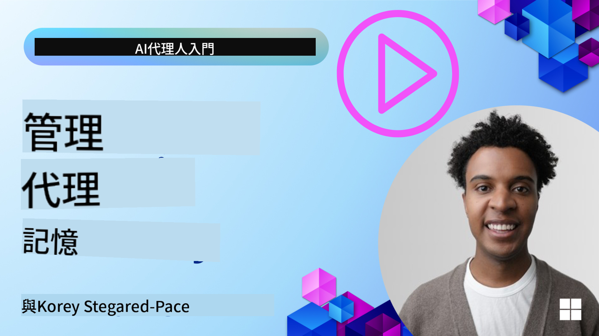

<!--
CO_OP_TRANSLATOR_METADATA:
{
  "original_hash": "c27e2a2e9055910545560e8472b341d8",
  "translation_date": "2025-10-02T13:52:46+00:00",
  "source_file": "13-agent-memory/README.md",
  "language_code": "mo"
}
-->
# AI代理的記憶

在討論創建AI代理的獨特優勢時，主要涉及兩個方面：調用工具完成任務的能力，以及隨時間改進的能力。記憶是創建能夠自我改進的代理的基礎，這些代理可以為用戶提供更好的體驗。

在本課程中，我們將探討AI代理的記憶是什麼，以及如何管理和利用它來提升應用的效能。

## 課程介紹

本課程將涵蓋：

• **理解AI代理的記憶**：什麼是記憶，以及它對代理的重要性。

• **實現和存儲記憶**：為AI代理添加記憶功能的實用方法，重點關注短期和長期記憶。

• **讓AI代理自我改進**：記憶如何幫助代理從過去的互動中學習並隨時間改進。

## 學習目標

完成本課程後，您將能夠：

• **區分AI代理的不同記憶類型**，包括工作記憶、短期記憶和長期記憶，以及專門的記憶形式如角色記憶和情節記憶。

• **使用Semantic Kernel框架實現和管理AI代理的短期和長期記憶**，利用工具如Mem0和Whiteboard記憶，並與Azure AI Search集成。

• **理解自我改進AI代理的原理**，以及穩健的記憶管理系統如何促進持續學習和適應。

## 理解AI代理的記憶

從本質上講，**AI代理的記憶指的是使其能夠保留和回憶信息的機制**。這些信息可以是對話的具體細節、用戶偏好、過去的行動，甚至是學到的模式。

如果沒有記憶，AI應用通常是無狀態的，意味著每次互動都從零開始。這會導致重複且令人沮喪的用戶體驗，因為代理會“忘記”之前的上下文或偏好。

### 為什麼記憶很重要？

代理的智能與其回憶和利用過去信息的能力密切相關。記憶使代理能夠：

• **反思**：從過去的行動和結果中學習。

• **互動**：在持續的對話中保持上下文。

• **主動和反應**：根據歷史數據預測需求或做出適當的回應。

• **自主**：通過利用存儲的知識更獨立地運作。

實現記憶的目標是使代理更加**可靠和有能力**。

### 記憶的類型

#### 工作記憶

可以將其視為代理在單一任務或思考過程中使用的一張便條紙。它保存完成下一步所需的即時信息。

對於AI代理而言，工作記憶通常捕捉對話中最相關的信息，即使完整的聊天記錄很長或被截斷。它專注於提取關鍵元素，如需求、提案、決策和行動。

**工作記憶範例**

在旅行預訂代理中，工作記憶可能捕捉用戶的當前請求，例如“我想預訂去巴黎的旅行”。這一具體需求保存在代理的即時上下文中，以指導當前的互動。

#### 短期記憶

這種記憶在單次對話或會話期間保留信息。它是當前聊天的上下文，使代理能夠回顧對話中的前幾輪。

**短期記憶範例**

如果用戶問“去巴黎的航班要多少錢？”然後接著問“那裡的住宿呢？”，短期記憶確保代理知道“那裡”指的是“巴黎”，並且是在同一對話中。

#### 長期記憶

這是跨多次對話或會話持續存在的信息。它使代理能夠記住用戶偏好、歷史互動或長期的知識。這對個性化非常重要。

**長期記憶範例**

長期記憶可能存儲“Ben喜歡滑雪和戶外活動，喜歡在山景下喝咖啡，並希望避免高級滑雪坡道，因為過去曾受傷”。這些信息從之前的互動中學到，影響未來旅行規劃中的推薦，使其高度個性化。

#### 角色記憶

這種專門的記憶類型幫助代理建立一致的“個性”或“角色”。它使代理能夠記住關於自身或其預定角色的細節，使互動更加流暢和專注。

**角色記憶範例**

如果旅行代理被設計為“滑雪規劃專家”，角色記憶可能強化這一角色，影響其回應以符合專家的語氣和知識。

#### 工作流/情節記憶

這種記憶存儲代理在執行複雜任務時的步驟序列，包括成功和失敗。它就像記住特定的“情節”或過去的經驗，以便從中學習。

**情節記憶範例**

如果代理嘗試預訂特定航班但因不可用而失敗，情節記憶可以記錄這一失敗，使代理在後續嘗試中嘗試替代航班或更有信息地通知用戶問題。

#### 實體記憶

這涉及從對話中提取並記住特定的實體（如人物、地點或事物）和事件。它使代理能夠構建對討論的關鍵元素的結構化理解。

**實體記憶範例**

從關於過去旅行的對話中，代理可能提取“巴黎”、“埃菲爾鐵塔”和“在Le Chat Noir餐廳的晚餐”作為實體。在未來的互動中，代理可以回憶“Le Chat Noir”，並提供再次預訂那裡的選項。

#### 結構化RAG（檢索增強生成）

雖然RAG是一種更廣泛的技術，“結構化RAG”被強調為一種強大的記憶技術。它從各種來源（對話、電子郵件、圖片）中提取密集的結構化信息，並用於提高回應的精確性、召回率和速度。與僅依賴語義相似性的經典RAG不同，結構化RAG利用信息的內在結構。

**結構化RAG範例**

結構化RAG可以解析電子郵件中的航班細節（目的地、日期、時間、航空公司），並以結構化方式存儲它們，而不僅僅是匹配關鍵字。這使得精確查詢如“我星期二預訂的去巴黎的航班是什麼？”成為可能。

## 實現和存儲記憶

為AI代理實現記憶涉及**記憶管理**的系統化過程，包括生成、存儲、檢索、整合、更新，甚至“忘記”（或刪除）信息。檢索是特別重要的一個方面。

### 專門的記憶工具

存儲和管理代理記憶的一種方法是使用專門的工具如Mem0。Mem0作為持久記憶層，允許代理回憶相關互動、存儲用戶偏好和事實上下文，並隨時間從成功和失敗中學習。其理念是將無狀態代理轉變為有狀態代理。

它通過**兩階段記憶管道：提取和更新**運作。首先，添加到代理線程的消息被發送到Mem0服務，該服務使用大型語言模型（LLM）總結對話歷史並提取新記憶。隨後，LLM驅動的更新階段決定是否添加、修改或刪除這些記憶，並將它們存儲在混合數據存儲中，包括向量、圖形和鍵值數據庫。該系統還支持各種記憶類型，並可以整合圖形記憶以管理實體之間的關係。

### 使用RAG存儲記憶

除了像Mem0這樣的專門記憶工具，您還可以利用強大的搜索服務如**Azure AI Search作為存儲和檢索記憶的後端**，特別是針對結構化RAG。

這使您能夠用自己的數據來支持代理的回應，確保更相關和準確的答案。Azure AI Search可以用於存儲用戶特定的旅行記憶、產品目錄或任何其他領域的知識。

Azure AI Search支持如**結構化RAG**的功能，這在從大型數據集（如對話歷史、電子郵件或圖片）中提取和檢索密集結構化信息方面表現出色。與傳統的文本分塊和嵌入方法相比，這提供了“超人級的精確性和召回率”。

## 讓AI代理自我改進

自我改進代理的一個常見模式是引入**“知識代理”**。這個獨立的代理觀察用戶與主要代理之間的對話。其角色是：

1. **識別有價值的信息**：確定對話中的任何部分是否值得保存為一般知識或特定的用戶偏好。

2. **提取和總結**：從對話中提煉出關鍵的學習或偏好。

3. **存儲到知識庫**：將提取的信息持久化，通常存儲在向量數據庫中，以便稍後檢索。

4. **增強未來查詢**：當用戶發起新查詢時，知識代理檢索相關的存儲信息並將其附加到用戶的提示中，為主要代理提供關鍵上下文（類似於RAG）。

### 記憶的優化

• **延遲管理**：為避免減慢用戶互動，可以初步使用更便宜、更快的模型快速檢查信息是否值得存儲或檢索，僅在必要時調用更複雜的提取/檢索過程。

• **知識庫維護**：對於不斷增長的知識庫，使用頻率較低的信息可以移至“冷存儲”以管理成本。

## 還有更多關於代理記憶的問題嗎？

加入[Azure AI Foundry Discord](https://aka.ms/ai-agents/discord)，與其他學習者交流，參加辦公時間，並解答您的AI代理相關問題。

---

**免責聲明**：  
本文件已使用 AI 翻譯服務 [Co-op Translator](https://github.com/Azure/co-op-translator) 進行翻譯。雖然我們致力於提供準確的翻譯，但請注意，自動翻譯可能包含錯誤或不準確之處。原始文件的母語版本應被視為權威來源。對於關鍵資訊，建議使用專業人工翻譯。我們對因使用此翻譯而引起的任何誤解或誤釋不承擔責任。